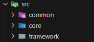
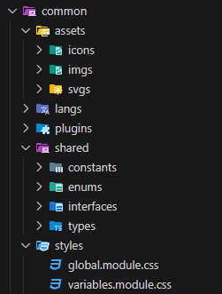
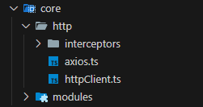
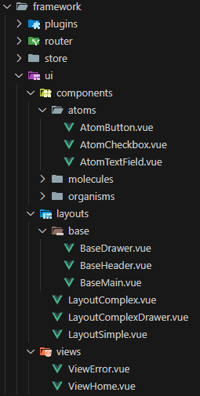

# template-vue-ts

Repositorio base para proyectos, implementado con Vite + Vue3 + Typescript

### Estructura de carpetas

La carpeta src contiene tres secciones una common ( shared ), core ( APIs + HTTP ) y framework ( vue, react, angular, etc ).

En primer lugar dentro del src tendria tres secciones.

### **Common**

Incluiria a todos los componentes de la aplicacion que sean reutilizables e independientes del framework.

### **Core**

Incluiria a todo componente reacionado con peticiones http y comunicaciones con API ( repositorios ).

### **Framework**

Incluiria a todos los componentes que influyen en el funcionamiento del framework o libreria que se este utilizando, como por ejemplo el store, router o la interfaz de usuario ( UI ).

### Si ves esto y queres comentarme una mejora para esta estructura basica por favor comentamelo. Estoy aprendiendo y acepto cualquier consejo! Gracias.

# Contacto

Email: **spiattajuanpablodesarrollador@gmail.com**
